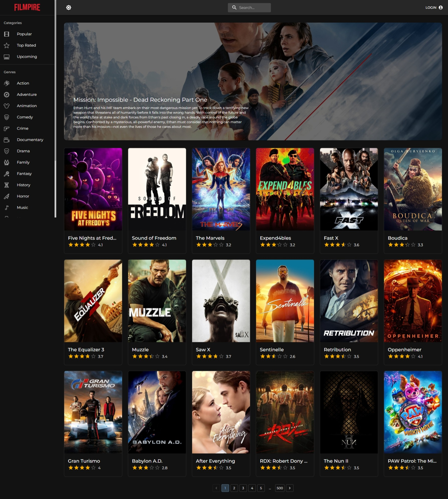
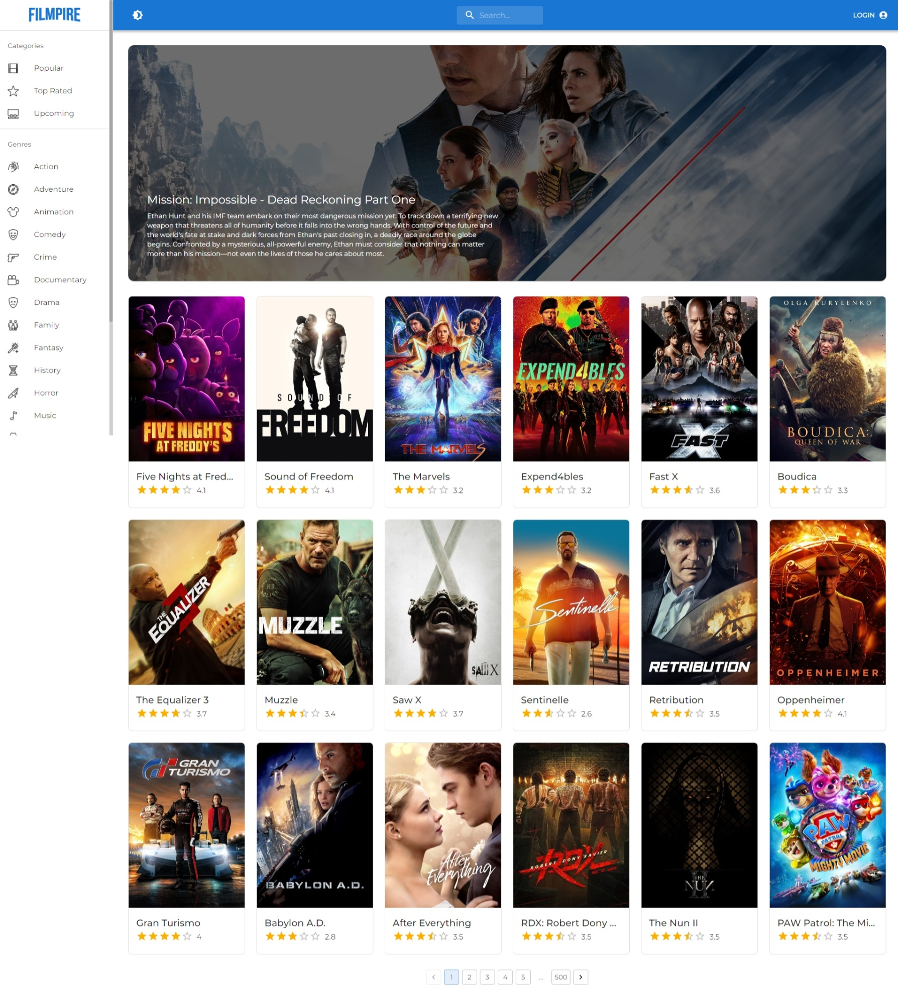
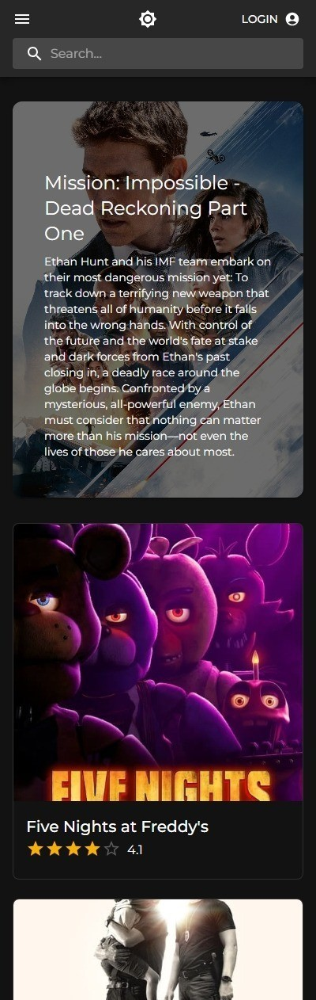
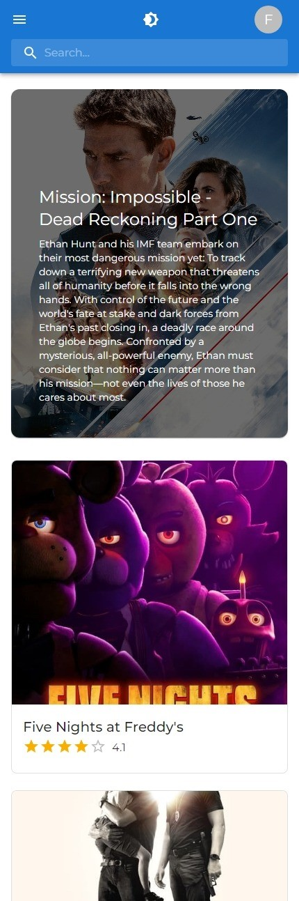
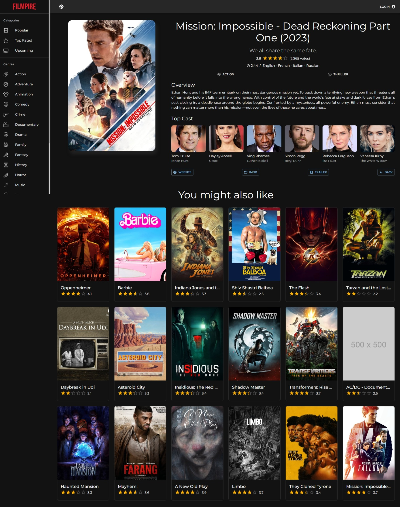
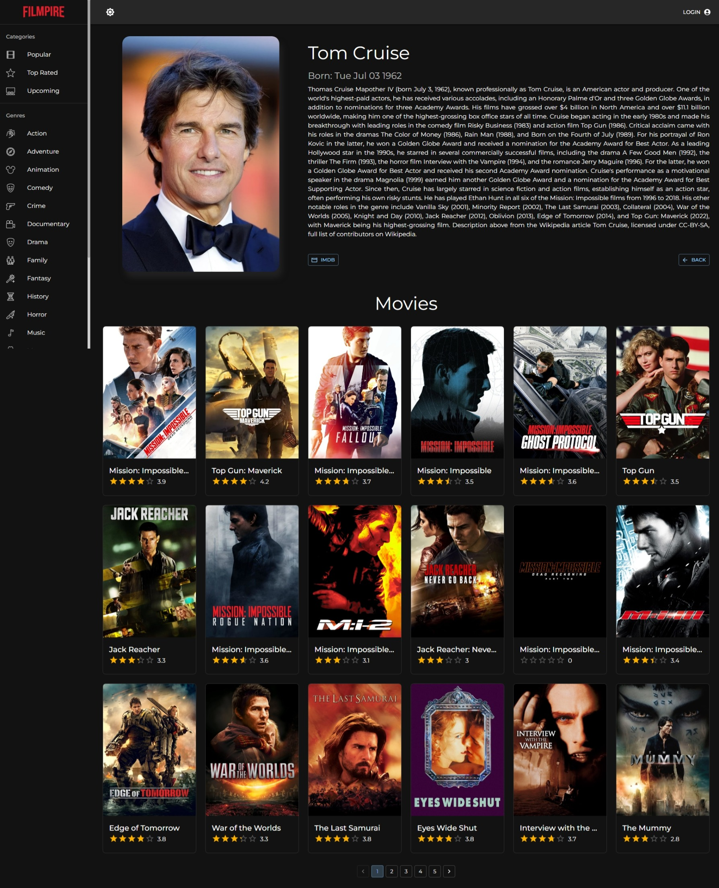
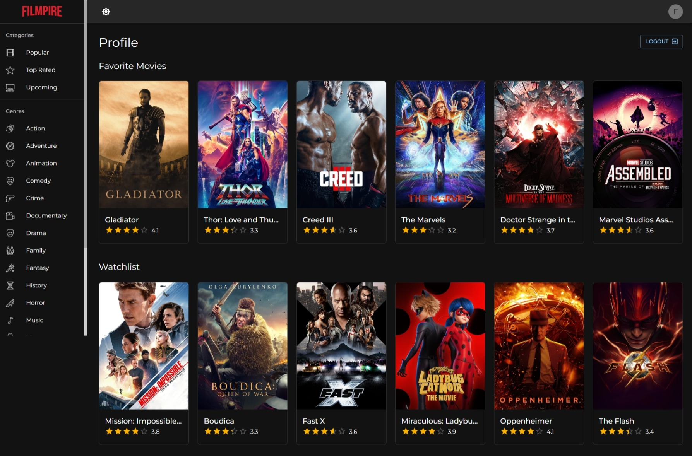

# Filmpire

Filmpire is a web-based movie discovery application that allows users to search for movies, sort them by category or genre, view their details and those of their actors, add them to their favorites or watchlist, and much more.

## Demo

<https://styled-filmpire.netlify.app>

## Get started locally

1. Clone this repository to your locl machine.
2. Run `npm install` to install the required dependencies.
3. Get a TMDB API key at <https://developer.themoviedb.org/docs/getting-started>. You'll have to create an account first.
4. Duplicate the `.env.example` file and rename it to `.env.local` and add your API key in there.
5. Run `npm run dev` to start the local web server.

## Screenshots

### Movies list - Desktop

### Movies list - Mobile

### Movie details

### Actor details

### Profile

